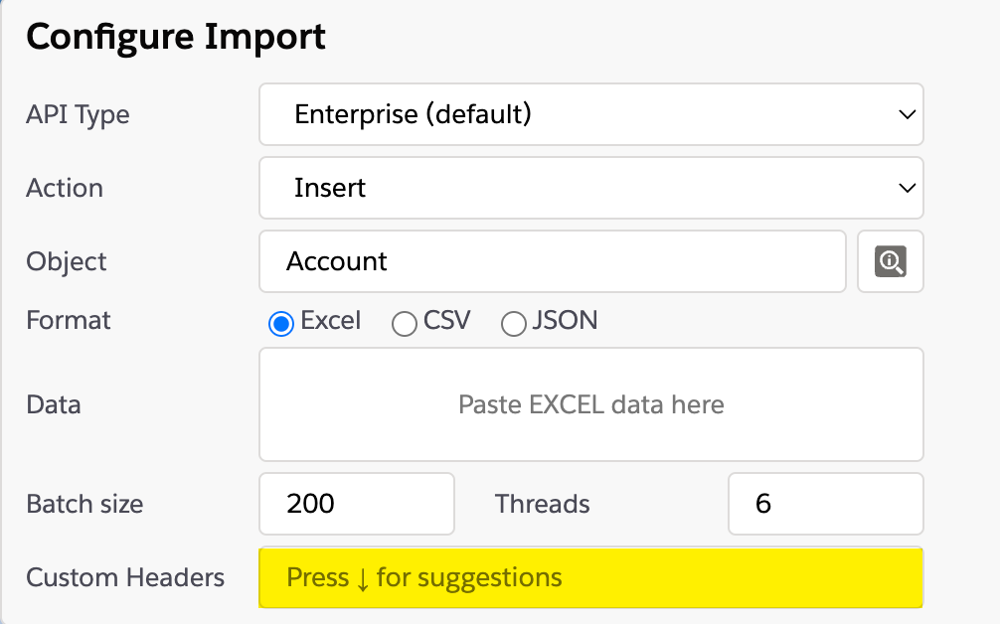
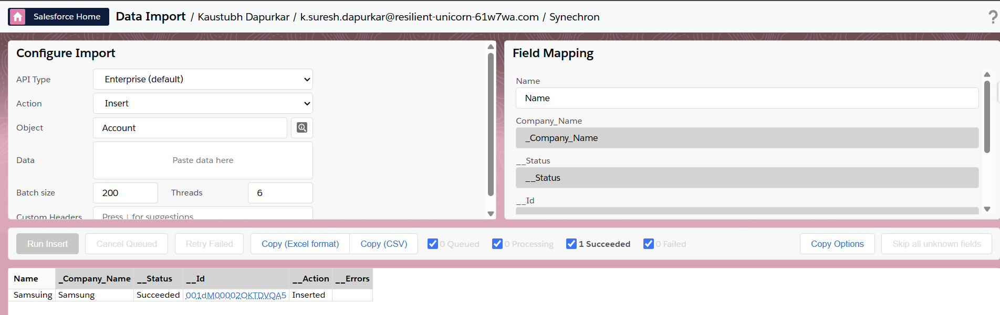

# Data Import

## Configure Import options in Data Import

You can configure the [SOAP headers](https://developer.salesforce.com/docs/atlas.en-us.api.meta/api/soap_headers.htm) when importing records to specify Assignment Rule, Duplicate Rule or OwnerChangeOptions.
Because custom headers can be hard to configure, you could iterate through suggestions by pressing down key.
If you want to include new suggestions, feel free to open a new [feature request](https://github.com/Hoofddev/sf-inspector/issues/new).

If true, the account team is kept with the account when the account owner is changed. If false, the account team is deleted:
``` json
{"OwnerChangeOptions": {"options": [{"type": "KeepAccountTeam", "execute": true}]}}
```

For a duplicate rule, when the Alert option is enabled, bypass alerts and save duplicate records by setting this property to true:
``` json
  '{"DuplicateRuleHeader": {"allowSave": true}}'
```

If true for a Case or Lead, uses the default (active) assignment rule for a Case or Lead. If specified, don't specify an assignmentRuleId. If true for an Account, all territory assignment rules are applied. If false for an Account, no territory assignment rules are applied.
``` json
  '{"AssignmentRuleHeader": {"useDefaultRule": true}}',
```



## Grey out skipped columns in data import

From the 'Options' tab, enable the 'Grey Out Skipped Columns in Data Import' option and perform the data import. The un-imported columns will be greyed out.

