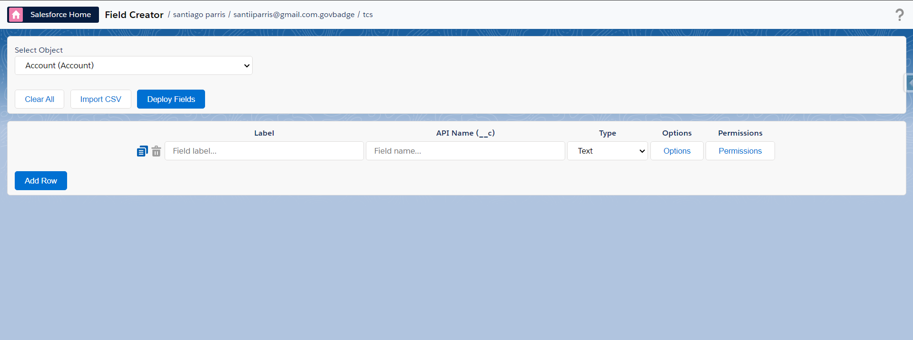
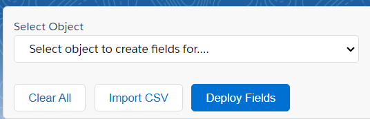
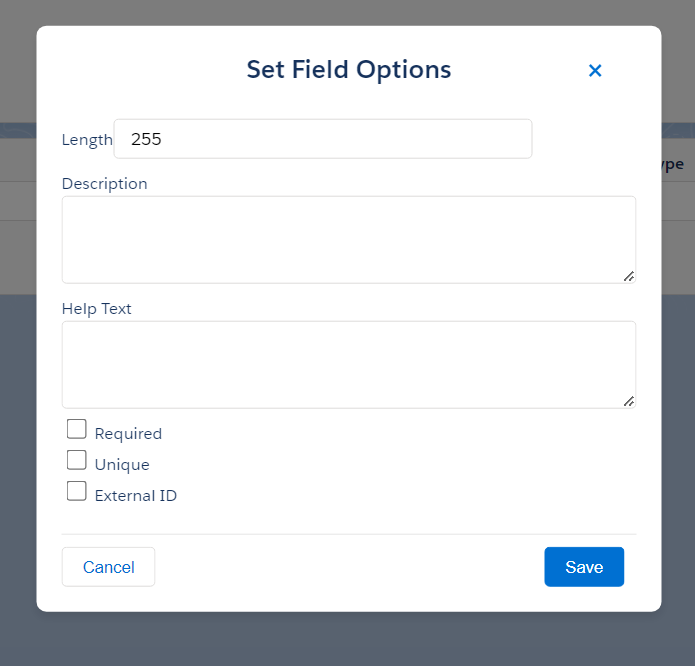
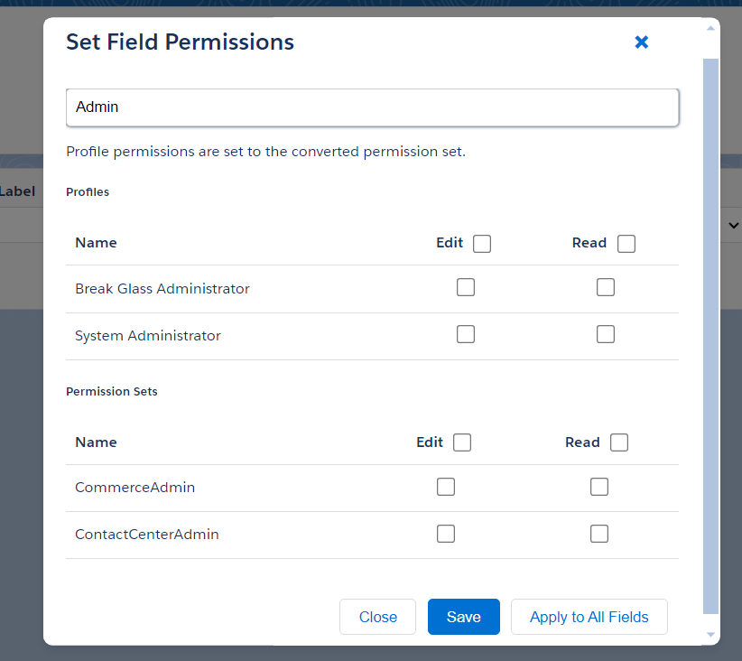
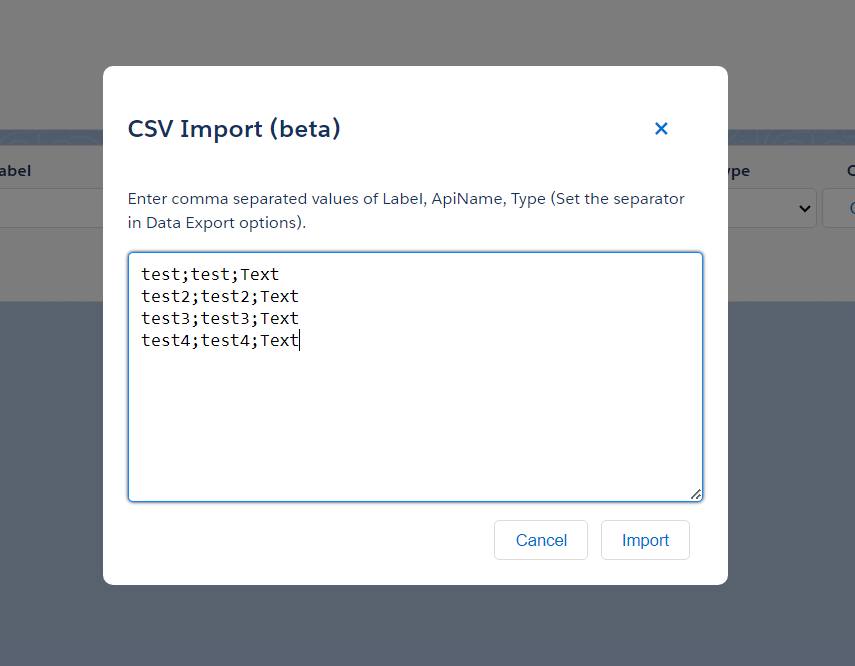
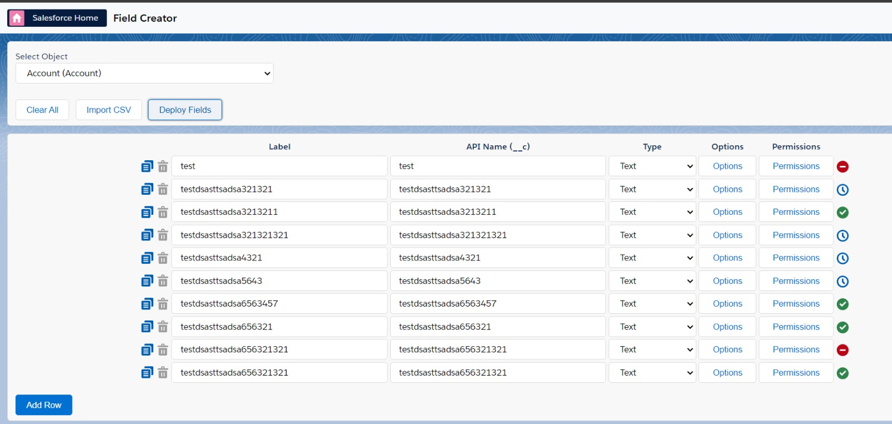
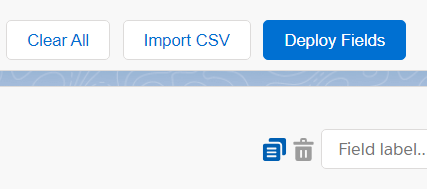
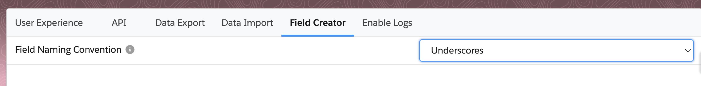

# Field Creator

## Eligible Objects

The Field Creator supports creating fields for the following types of objects:

- **Standard Objects** - Objects that support page layouts (Account, Contact, Opportunity, etc.)
- **Custom Objects** - User-defined objects ending with `__c`
- **Platform Events** - Event objects ending with `__e` for real-time event processing
- **Custom Metadata Types** - Configuration objects ending with `__mdt`

> **Note**: The field types available and permissions behavior may vary depending on the object type selected. For example, Platform Events have limited field type support and do not use field-level security.

## Supported Field Types

The Field Creator feature supports the following field types:

### For Standard Objects and Custom Objects
- **Checkbox**
- **Currency**
- **Number**
- **Percent**
- **Date**
- **DateTime**
- **Email**
- **Phone**
- **Url**
- **Location**
- **Picklist**
- **Multiselect Picklist**
- **Text**
- **TextArea**
- **LongTextArea**
- **Html**

### For Platform Events (Limited Support)
- **Checkbox**
- **Date**
- **DateTime**
- **Number**
- **Text**
- **LongTextArea**

> **Platform Event Limitations**: Platform Events do not support Help Text, Unique constraints, or External ID options. Only the Description field property is available.

## Getting Started

1. Open the Field Creator through the pop-up.

 

2. Select the object you want to create fields for from the dropdown menu.
3. Use the managed package toggle to include/exclude objects from managed packages in the object selector.

## Creating Fields

1. Click "Add Row" to add a new field.
2. Fill in the Label, API Name, and select the Field Type.
3. Click "Options" to set additional field properties (This modal will be dynamic depending on the field type).
4. Click "Permissions" to set field-level security, use the "Apply to All Fields" option in the Permissions modal to quickly set permissions for all fields.

   

   

## Bulk Import

1. Click "Import CSV" to open the import modal.
2. Enter comma-separated values in the format: Label, API Name, Type. (The separator can be configured from the extension options)
3. Click "Import" to add the fields to your list.

## Deploying Fields

1. Review your field list for accuracy.
2. Click "Deploy Fields" to create the fields in your Salesforce org.
3. Check the deployment status icon for each field.

## Additional Features

- Use "Clone" to duplicate a field row.
- Use "Delete" to remove a field row.
- Click "Clear All" to reset the entire field list.

## Available Options
- You can choose the default naming convention ('PascalCase' or 'Underscore') for the API Name of the fields.
- You can configure whether to include managed package objects in the object selector (disabled by default).

