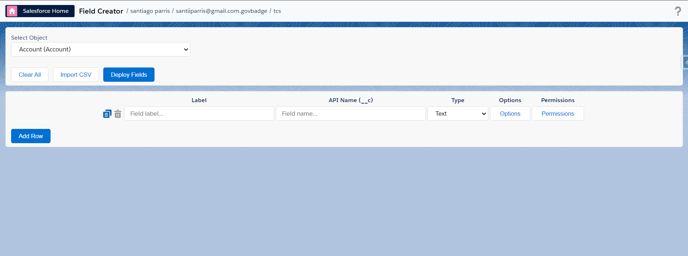
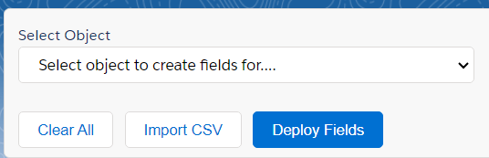
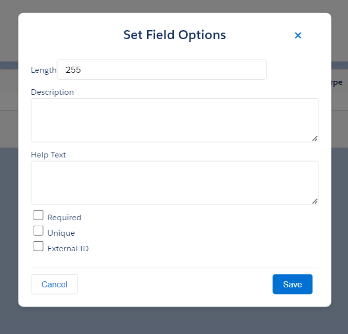
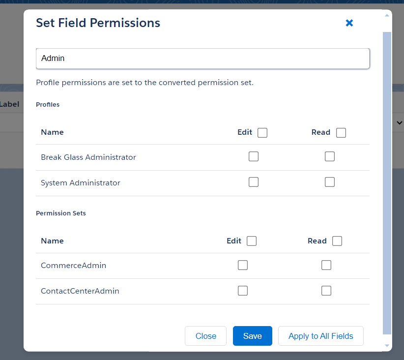
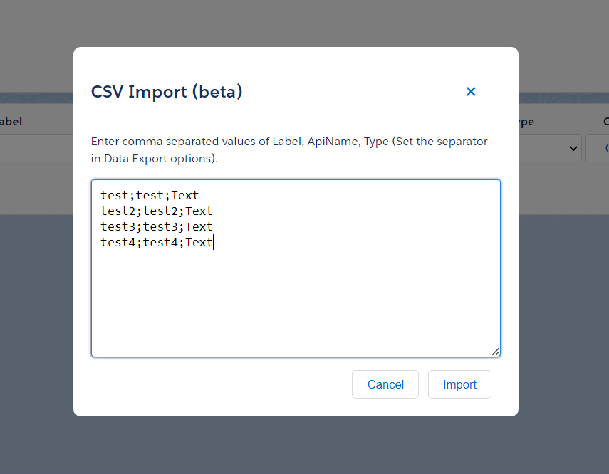
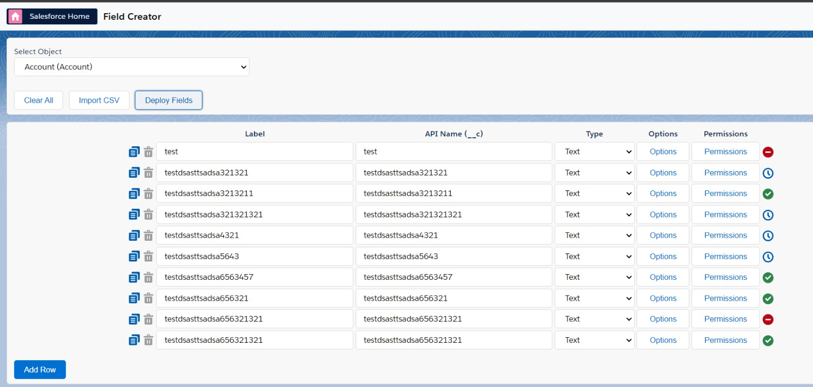
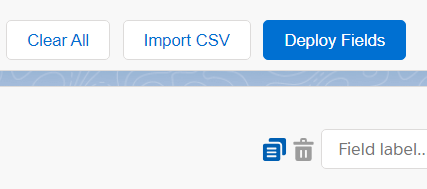
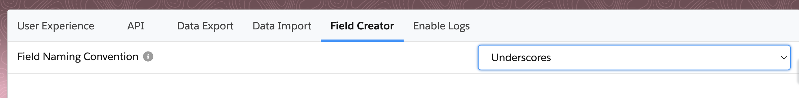

# Field Manager

## Eligible Objects

The Field Manager supports creating fields for the following types of objects:

- **Standard Objects** - Objects that support page layouts (Account, Contact, Opportunity, etc.)
- **Custom Objects** - User-defined objects ending with `__c`
- **Platform Events** - Event objects ending with `__e` for real-time event processing
- **Custom Metadata Types** - Configuration objects ending with `__mdt`

> **Note**: The field types available and permissions behavior may vary depending on the object type selected. For example, Platform Events have limited field type support and do not use field-level security.

## Supported Field Types

The Field Manager feature supports the following field types:

### For Standard Objects and Custom Objects
- **Checkbox**
- **Currency**
- **Number**
- **Percent**
- **Date**
- **DateTime**
- **Email**
- **Phone**
- **Url**
- **Location**
- **Picklist**
- **Multiselect Picklist**
- **Text**
- **TextArea**
- **LongTextArea**
- **Html**

### For Platform Events (Limited Support)
- **Checkbox**
- **Date**
- **DateTime**
- **Number**
- **Text**
- **LongTextArea**

> **Platform Event Limitations**: Platform Events do not support Help Text, Unique constraints, or External ID options. Only the Description field property is available.

## Getting Started

1. Open the Field Manager through the pop-up.

 

2. Select the object you want to create fields for from the dropdown menu.
3. Use the managed package toggle to include/exclude objects from managed packages in the object selector.

## Creating Fields

1. Click "Add Row" to add a new field.
2. Fill in the Label, API Name, and select the Field Type.
3. Click "Options" to set additional field properties (This modal will be dynamic depending on the field type).
4. Click "Permissions" to set field-level security, use the "Apply to All Fields" option in the Permissions modal to quickly set permissions for all fields.

   

   

## Editing Existing Fields

1. Select an object and click "Retrieve Fields". The object's existing custom fields are added to the table, marked "Existing".
2. Change the Label in the table, or open "Options" to change the Description and Help Text. The API name, type and every other attribute are shown for reference and cannot be changed here.
3. Turn on "Updating existing fields allowed" and click "Deploy Fields". A confirmation lists the fields that will be updated before anything is saved. The switch is off again every time the page is opened.

Existing fields of types this page cannot create can still be edited this way: Lookup, Master-Detail, Roll-Up Summary, Auto Number, Text (Encrypted), Metadata Relationship, External Lookup, Indirect Lookup, Hierarchy and Time. They only ever appear for retrieved fields, never as a type for a new field.

> **How updates are saved**: the field's metadata is fetched as-is when you retrieve it, and saved back with only Label, Description and Help Text replaced. Type, length, picklist values, required, unique and external ID are sent back exactly as they were, so they cannot change by accident. Retrieving fields is not available for Platform Events.

## Sorting and Export

- Click the Label, API Name or Type column header to sort the table; click again to reverse the order.
- "Download CSV", "Copy CSV" and "Copy Excel" export the table (Label, Name, Type, Description, HelpText) once fields have been retrieved.

## Bulk Import

1. Click "Import" to open the import modal.
2. Enter comma-separated values in the format: Label, API Name, Type, and optionally Description and Help Text. (The separator can be configured from the extension options.) A row whose API Name matches a retrieved field updates that field's Label, Description and Help Text instead of adding a new row, so an exported table can be edited and pasted back.
3. Click "Import" to add the fields to your list.

## Deploying Fields

1. Review your field list for accuracy.
2. Click "Deploy Fields" to create the fields in your Salesforce org.
3. Check the deployment status icon for each field.

## Additional Features

- Use "Clone" to duplicate a field row.
- Use "Delete" to remove a field row.
- Click "Clear All" to reset the entire field list.

## Available Options
- You can choose the default naming convention ('PascalCase' or 'Underscore') for the API Name of the fields.
- You can configure whether to include managed package objects in the object selector (disabled by default).

