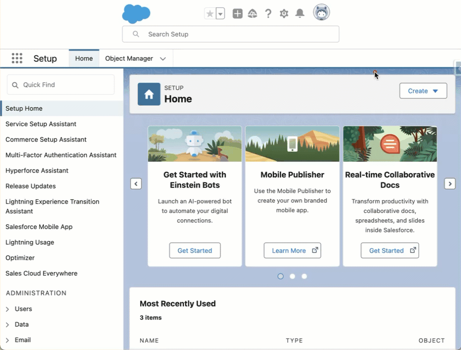

# Welcome

**SF Inspector** is a Safari extension for macOS that helps you inspect, analyse and optimise your
Salesforce data and metadata.

With it, you can:

- View and edit field-level details — API name, type, label and value — for any Salesforce record.
- Jump to setup pages, and search metadata from the Shortcuts tab.
- Export data to CSV, Excel or JSON.
- Import data to create or update records.
- Run SOQL queries against data and metadata.
- Build REST API requests from Explore API.
- Search every flow in the org from the Setup flow list.

## Opening it

Once the extension is enabled, a small arrow appears at the right-hand edge of any Salesforce page.
Click it to open the panel, or press <kbd>Control</kbd> + <kbd>Option</kbd> + <kbd>I</kbd>.

## If nothing appears

Two things have to be switched on, and the second is the one that catches people out:

1. **The extension itself** — Safari ▸ Settings ▸ Extensions, and tick **SF Inspector**.
2. **Access to your Salesforce sites** — in the same panel, set SF Inspector to **Always Allow** on
   your Salesforce domains.

Without the second, the extension loads but cannot read anything, and behaves as though you were
signed out. The SF Inspector app walks you through both when you open it.

## Getting help

If something is wrong or missing, [open an issue](https://github.com/Hoofddev/sf-inspector/issues)
on GitHub. There is also a bug icon in the panel's footer that goes straight there.
